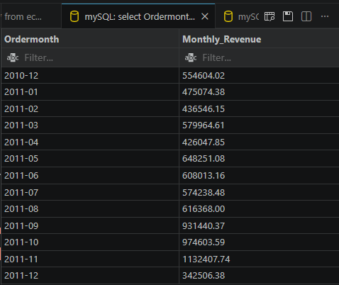
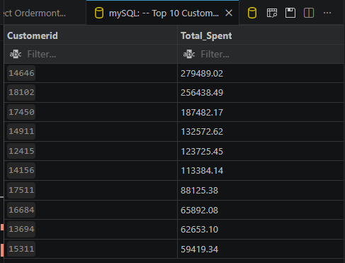
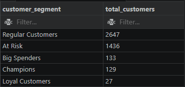
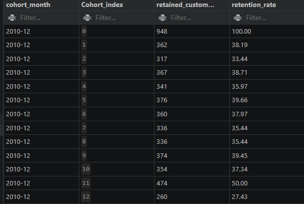
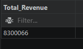
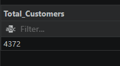
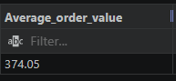
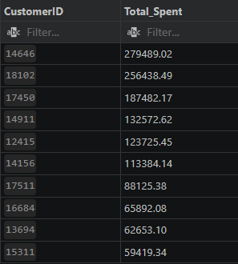

#  E-Commerce Customer Intelligence & Business Analytics System using MySQL


## Project Overview

This project focuses on building a complete end-to-end business intelligence and customer analytics system using MySQL and real-world e-commerce transactional data.

The solution simulates a real-world retail analytics environment by integrating:

- Data Cleaning & Validation
- Revenue & Sales Analysis
- Customer Segmentation using RFM Modeling
- Cohort Retention Analysis
- Executive KPI Reporting
- SQL Views & Stored Procedures
- Business Insights & Strategic Recommendations

The primary objective of this project is to analyze customer purchasing behavior, identify high-value customers, evaluate customer retention trends, and generate business insights to support data-driven decision-making.

---

## Quick Navigation

- [Dataset Information](#dataset-information)
- [Business Problem](#business-problem)
- [Revenue Analysis](#revenue-analysis)
- [RFM Customer Segmentation](#rfm-customer-segmentation)
- [Cohort Retention Analysis](#cohort-retention-analysis)
- [Executive KPI Reporting](#executive-kpi-reporting)
- [Project Screenshots](#project-screenshots)
- [Conclusion](#conclusion)

---

## Dataset Information

- Dataset Source: Kaggle Online Retail Dataset
- Dataset Type: E-Commerce Transactional Data
- Total Records: 500K+ Transactions

- Dataset Source: Kaggle Online Retail Dataset
- Dataset Link: https://www.kaggle.com/datasets/carrie1/ecommerce-data
- Dataset Type: E-Commerce Transactional Data
- Total Records: 500K+ Transactions

### Dataset Columns

| Column | Description |
|---|---|
| InvoiceNo | Unique invoice number |
| StockCode | Product identifier |
| Description | Product description |
| Quantity | Quantity purchased |
| InvoiceDate | Transaction timestamp |
| UnitPrice | Price per product |
| CustomerID | Customer identifier |
| Country | Customer country |

The dataset contains real-world online retail transactions used for customer behavior and business analytics.

---

## Business Problem

Retail businesses generate massive amounts of transactional data but often struggle to transform raw transactions into actionable business insights.

This project addresses key business challenges such as:

- Identifying high-value customers
- Understanding customer purchasing behavior
- Measuring customer retention trends
- Detecting churn-risk customers
- Evaluating product and market performance
- Supporting strategic business decision-making

The project demonstrates how SQL can be used to build scalable analytical solutions for customer intelligence and revenue optimization.
---

## Project Structure

```text id="3g9ztm"
E-Commerce-Customer-Analytics/
│
├── datasets/
│   └── data.csv
│
├── sql/
│   ├── 01_database_setup.sql
│   ├── 02_data_cleaning.sql
│   ├── 03_data_transformation.sql
│   ├── 04_revenue_analysis.sql
│   ├── 05_rfm_analysis.sql
│   ├── 06_cohort_analysis.sql
│   ├── 07_business_kpis.sql
│   ├── 08_views.sql
│   ├── 09_stored_procedures.sql
│   └── 10_final_business_insights.sql
│
├── screenshots/
│
└── README.md
````

---

## Technologies Used

- MySQL
- SQL
- Visual Studio Code
- Kaggle Dataset

### SQL Concepts Used

- Data Cleaning
- Aggregations
- Group By
- Joins
- CTEs
- Views
- Stored Procedures
- Customer Segmentation
- Cohort Analysis
- KPI Reporting

---

## Analytical Workflow

The project follows a structured analytical workflow:

1. Raw CSV Data Ingestion
2. Data Cleaning & Validation
3. Data Transformation & Feature Engineering
4. Revenue & Sales Analysis
5. Customer Segmentation (RFM)
6. Cohort Retention Analysis
7. KPI Reporting
8. SQL Views & Stored Procedures
9. Business Insight Generation
10. Strategic Recommendations

---

## Data Cleaning Process

The raw transactional dataset contained several inconsistencies and data quality issues.

### Cleaning Steps Performed

- Removed records with missing Customer IDs
- Removed invalid quantities and negative transactions
- Removed invalid unit prices
- Converted InvoiceDate into DATETIME format
- Standardized customer identifiers
- Validated transaction integrity

### Business Impact

These cleaning operations improved data quality and ensured accurate analytical reporting.

---

## Data Transformation

Additional business-focused analytical columns were created to improve reporting and customer analysis.

### Transformations Performed

- Revenue column created using:
  
  Revenue = Quantity × UnitPrice

- OrderMonth column generated for monthly trend analysis
- Business-ready KPI metrics prepared for reporting

### Business Value

The transformed dataset enabled advanced revenue analytics, customer segmentation, and retention analysis.

---

## Revenue Analysis

Revenue analysis was performed to evaluate business growth, customer spending behavior, and product performance.

### Key Analyses

- Total Revenue
- Monthly Revenue Trends
- Average Order Value
- Top Customers by Revenue
- Top Selling Products
- Country-wise Revenue Analysis
- Daily Revenue Trends

### Key Findings

- The business generated strong revenue through repeat customers.
- Certain products consistently drove high sales volume.
- The United Kingdom contributed the highest overall revenue.
- Seasonal revenue spikes were observed during holiday periods.

---

## RFM Customer Segmentation

RFM analysis was performed to classify customers based on purchasing behavior.

### RFM Metrics

| Metric | Description |
|---|---|
| Recency | How recently a customer purchased |
| Frequency | How often the customer purchases |
| Monetary | Total customer spending |

### Customer Segments Created

- Champions
- Loyal Customers
- Big Spenders
- At Risk Customers
- Regular Customers

### Business Value

RFM segmentation helps businesses:
- identify high-value customers
- reduce customer churn
- improve retention campaigns
- optimize marketing strategies

---

## Cohort Retention Analysis

Cohort analysis was performed to measure customer retention and repeat purchasing behavior over time.

### Objectives

- Track long-term customer engagement
- Measure customer retention trends
- Analyze repeat purchase behavior
- Evaluate cohort performance

### Key Findings

- Holiday-period cohorts demonstrated stronger retention behavior.
- Customer retention gradually declined over time.
- Some customer groups maintained stable long-term engagement.
- Seasonal periods showed higher customer re-engagement activity.

### Business Value

Cohort analysis helps organizations improve:
- retention strategies
- lifecycle marketing
- customer engagement
- repeat purchase optimization

---

## Executive KPI Reporting

Executive business KPIs were developed to support management-level decision making.

### Executive KPIs Generated

- Total Revenue
- Total Orders
- Total Customers
- Average Order Value
- Repeat Customer Percentage
- Monthly Active Customers
- Top Revenue Markets
- VIP Customers

### Business Impact

These KPIs provide a high-level overview of:
- business growth
- customer behavior
- operational performance
- revenue health

---

## SQL Views & Stored Procedures

Reusable SQL views and stored procedures were developed to simulate enterprise-level reporting systems.

### SQL Views Created

- Monthly Sales View
- Customer Summary View
- Product Performance View
- Country Sales View
- Customer Segment View

### Stored Procedures Created

- Top Customer Reporting
- Monthly Revenue Reporting
- Country Revenue Reporting
- Customer Segment Reporting

### Business Value

These components improve:
- report automation
- reusable analytics
- dashboard integration
- business reporting efficiency

---

## Final Business Insights

### Revenue Insights

- Repeat customers generated significant revenue contribution.
- Seasonal sales spikes indicated strong holiday purchasing behavior.

### Customer Insights

- Loyal customers and champions represented the most valuable customer groups.
- Several high-value customers were identified as churn risks.

### Retention Insights

- Holiday acquisition cohorts demonstrated stronger long-term retention.
- Retention rates gradually declined after initial purchases.

### Strategic Recommendations

- Launch targeted retention campaigns
- Improve loyalty programs
- Expand high-performing products
- Personalize customer marketing strategies

---

## Project Screenshots

### Monthly Revenue Analysis



---

### Top Customers Analysis



---

### RFM Customer Segmentation



---

### Cohort Retention Analysis



---

### Executive KPI Reporting

#### Revenue


#### Total Customers


#### Average order value


---

### Stored Procedures Output

#### CALL GetTopCustomers


---

## Key Skills Demonstrated

- SQL Query Optimization
- Data Cleaning & Transformation
- Business Intelligence Reporting
- Revenue Analytics
- Customer Segmentation
- Cohort Retention Analysis
- Executive KPI Development
- SQL Views & Stored Procedures
- Analytical Problem Solving
- Business Insight Generation

---

## Project Outcomes

This project successfully demonstrated:

- End-to-end SQL business analytics workflow
- Customer behavior analysis
- Revenue and sales intelligence
- Customer segmentation using RFM analysis
- Customer retention analysis using cohort modeling
- Executive KPI reporting
- Reusable SQL views and stored procedures
- Business insight generation and recommendations

The project simulates a real-world business intelligence and customer analytics system used in e-commerce organizations.

---

## Future Improvements

Possible future enhancements include:

- Power BI Dashboard Integration
- Predictive Customer Churn Analysis
- Automated Reporting Pipelines
- Customer Lifetime Value (CLV) Modeling
- Product Recommendation System
- Advanced Time-Series Revenue Forecasting

---

## Conclusion

This project demonstrates the design and implementation of a complete SQL-based business intelligence and customer analytics solution using real-world e-commerce transactional data.           

The project combines:

- data engineering workflows
- analytical SQL techniques
- customer intelligence modeling
- retention analysis
- executive KPI reporting
- reusable reporting architecture

The implementation reflects real-world analytical workflows commonly used by Data Analysts, Business Intelligence Analysts, Product Analysts, and Customer Analytics teams.

This project highlights strong SQL development, analytical thinking, and business problem-solving capabilities.

